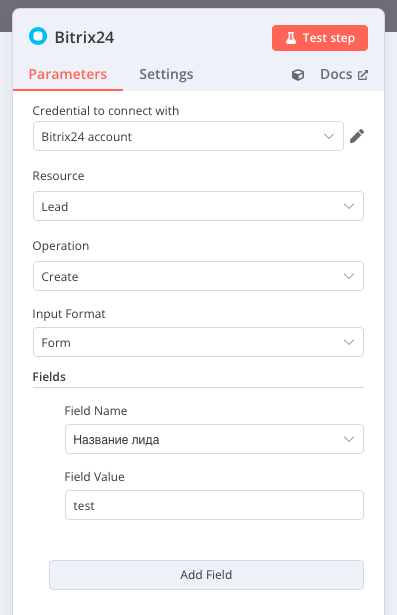

# n8n-nodes-bitrix24


Этот пакет содержит ноду для n8n для работы с Bitrix24 API.

## Установка

## Использование

1. В Bitrix24 создайте входящий вебхук (REST API)
2. Скопируйте URL вебхука
3. В n8n добавьте новые учетные данные типа "Bitrix24 API"
4. Вставьте URL вебхука в поле "Webhook URL"
5. Используйте ноду Bitrix24 в ваших рабочих процессах



## Функциональность
- Bitrix24 - работа с основными сущностями (Lead, Deal, Contact, Company)
- Bitrix24Auxiliary - работа с вспомогательными сущностями (Category, Status)
- Bitrix24UserField - работа с пользовательскими полями
### Поддерживаемые сущности (Resources)
- Lead (Лиды)
- Deal (Сделки)
- Contact (Контакты)
- Company (Компании)

### Операции
- Create (Создание записи)
  - Выбор поля из списка доступных
  - Установка значения поля
- Get (Получение записи)
  - Получение по ID
  - Выбор возвращаемых полей
- List (Получение списка)
  - Возможность получить все записи
  - Ограничение количества записей
  - Выбор возвращаемых полей
- Update (Обновление)
  - Обновление по ID
  - Выбор поля из списка доступных
  - Установка нового значения
- Delete (Удаление)
  - Удаление по ID

### Особенности

- Динамическая загрузка полей в зависимости от выбранной сущности
- Подробная информация о каждом поле (тип, обязательность, только для чтения, множественность)
- При обновлении поля типа enumeration, можно указать просто текст элемента, а не ID
- Поддержка пагинации при получении списка записей
- Обработка ошибок и возможность продолжить выполнение при ошибках
- Создание и обновление пользовательских полей
- Поддержка категорий и статусов для сделок (но не все операции, смотрите как есть)
-
## Разработка

### Добавление нового языка
Для добавления нового языка выполните следующие шаги:

1. Откройте файл `translations.ts`
2. Добавьте новый язык в тип `SupportedLanguage`
3. Создайте новый объект переводов по образцу существующих (ru, en)
4. Добавьте новый язык в объект `translations`
5. Модифицируйте функцию `detectLanguage()` для определения нового языка

### Запуск n8n для локального тестирования
```bash
npm run build
```
```bash
docker run -it --rm \
  --name n8n \
  -p 5678:5678 \
  -v n8n_data:/home/node/.n8n \
  -v  /Users/igorgerasimov/cursorWorkspace/n8n-nodes/bitrix24-n8n/n8n-nodes-bitrix24/dist:/home/node/.n8n/custom/node_modules//n8n-nodes-bitrix24 \ docker.n8n.io/n8nio/n8n
```
  -v -подключаем ноды


## Лицензия

[MIT](LICENSE)
 