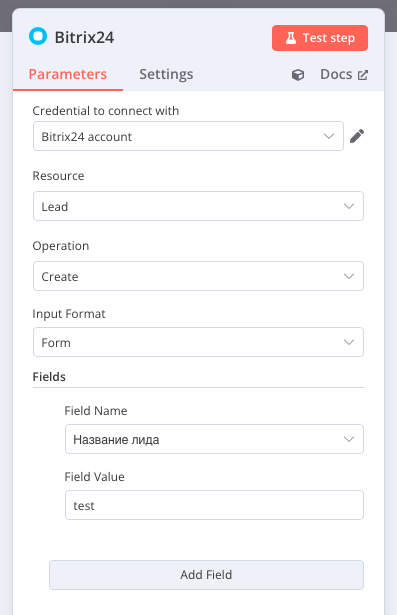

# n8n-nodes-bitrix24


Этот пакет содержит ноду для n8n для работы с Bitrix24 API.

Пожалуйста если у вас возникли вопросы или предложения, пишите в issues.

## Установка

## Использование

1. В Bitrix24 создайте входящий вебхук (REST API)
2. Скопируйте URL вебхука
3. В n8n добавьте новые учетные данные типа "Bitrix24 API"
4. Вставьте URL вебхука в поле "Webhook URL"
5. Используйте ноду Bitrix24 в ваших рабочих процессах



## Функциональность

Пакет содержит три ноды:

### Bitrix24
Работа с основными CRM-сущностями и смарт-процессами.

**Сущности:**
- Lead (Лиды)
- Deal (Сделки)
- Contact (Контакты)
- Company (Компании)
- Product (Товары)
- Smart Process Item (Элементы смарт-процессов)

**Операции:** Create, Get, List, Update, Delete

### Bitrix24Auxiliary
Работа с вспомогательными сущностями.

**Сущности:**
- Category (Воронки/направления)
- Status (Стадии/статусы)
- Smart Process Type (Типы смарт-процессов)
- Department (Отделы)
- Task (Задачи)
- Product Row (Товарные позиции)
- Call Statistic (Статистика звонков, только чтение)

### Bitrix24UserField
Работа с пользовательскими полями для Lead, Deal, Contact, Company.

### Особенности

- Динамическая загрузка полей в зависимости от выбранной сущности
- Подробная информация о каждом поле (тип, обязательность, только для чтения, множественность)
- При обновлении поля типа enumeration, можно указать просто текст элемента, а не ID
- Поддержка пагинации при получении списка записей
- Обработка ошибок и возможность продолжить выполнение при ошибках
## Разработка

### Добавление нового языка
Для добавления нового языка выполните следующие шаги:

1. Откройте файл `translations.ts`
2. Добавьте новый язык в тип `SupportedLanguage`
3. Создайте новый объект переводов по образцу существующих (ru, en)
4. Добавьте новый язык в объект `translations`
5. Модифицируйте функцию `detectLanguage()` для определения нового языка

### Запуск n8n для локального тестирования
```bash
npm run build
```
```bash
docker run -it --rm \
  --name n8n \
  -p 5678:5678 \
  -v n8n_data:/home/node/.n8n \
  -v /{path_to_n8n_nodes}/n8n-nodes-bitrix24/dist:/home/node/.n8n/custom/node_modules/n8n-nodes-bitrix24 \
  docker.n8n.io/n8nio/n8n
```

### Интеграционные тесты

Тесты проверяют CRUD-операции всех сущностей через реальный Bitrix24 портал.

```bash
# 1. Скопировать и заполнить .env.test
cp .env.test.example .env.test
# Вписать BITRIX24_WEBHOOK_URL

# 2. Установить зависимости
npm install

# 3. Запустить все тесты (116 тестов, 17 сьютов)
npm run test:integration

# 4. Или по группам
npm run test:integration:crm           # Lead, Deal, Contact, Company, Product
npm run test:integration:auxiliary      # Category, Status, SP Type, Department, Task, Product Row, Call Stat
npm run test:integration:smart-process  # Smart Process Item
npm run test:integration:userfields     # User Fields (Lead, Deal, Contact, Company)
```

## Лицензия

[MIT](LICENSE)
 